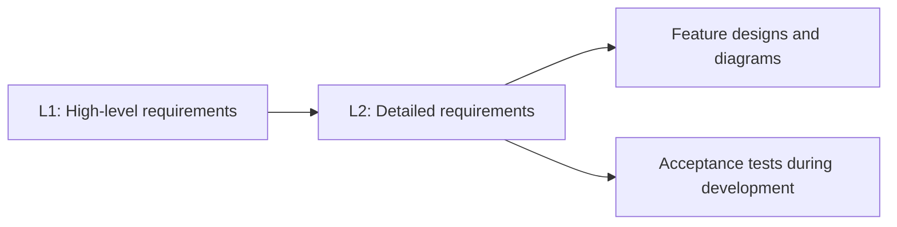

# Agent Toolkit

**Reusable agent skills for project guidance, requirements, and technical design.**

Agent Toolkit packages engineering workflows as version-controlled instructions,
references, and helper scripts. Use the skills across projects to establish coding
conventions, define system behavior, and produce design documents with diagrams
that trace back to testable requirements.

[Getting started](docs/getting-started.md) ·
[Available skills](#available-skills) ·
[Contributing](CONTRIBUTING.md) ·
[Support](SUPPORT.md) ·
[Changelog](CHANGELOG.md)

## Overview

- **Project guidance.** Generate `AGENTS.md` and agent-specific pointer files from
  a description of a new project using the bundled web or CLI conventions.
- **Traceable requirements.** Capture high-level capabilities (L1) and detailed
  behaviors (L2), with Given/When/Then acceptance criteria.
- **Consistent design documents.** Organize designs by subsystem and feature,
  with a shared writing style and explicit links to source requirements.
- **Diagrams alongside the design.** Author C4, class, and sequence diagrams in
  PlantUML and render PNG images for inline viewing on GitHub.
- **Portable skill folders.** Keep each skill's instructions and supporting
  resources together so they can be copied into a consuming project.

## Available skills

| Skill | Use it to | Output in the consuming project |
| --- | --- | --- |
| [Agent instruction files](skills/agent-instruction-files/SKILL.md) | Establish guidance for a new .NET CLI or Angular/.NET web project from its description. | `AGENTS.md`, `CLAUDE.md`, `GEMINI.md`, and `.github/copilot-instructions.md` |
| [Requirements engineer](skills/requirements-engineer/SKILL.md) | Create and maintain L1/L2 requirements, acceptance criteria, and test traceability. | `docs/specs/L1.md` and `docs/specs/L2.md` |
| [Software design document](skills/software-design-document/SKILL.md) | Develop feature designs from existing requirements, including components and rendered diagrams. | `docs/detailed-designs/{subsystem}/{feature}/` |

The design skill requires existing L1 and L2 requirements under `docs/specs/`.
The requirements skill establishes the acceptance criteria used during development.



## Quick start

1. Clone the repository:

   ```sh
   git clone https://github.com/QuinntyneBrown/agent-toolkit.git
   cd agent-toolkit
   ```

2. Install all skills into your personal Codex skills directory with Python 3.10 or later:

   ```sh
   python scripts/install_skills.py
   ```

   The installer uses `$CODEX_HOME/skills` when set, otherwise `~/.codex/skills`.
   It includes all supporting files and refuses to overwrite differing copies.
   See the [installation guide](docs/getting-started.md#install-the-skills)
   for project scope, alternative locations, and updates.

3. Open Codex in the consuming project. For a new project, establish its agent guidance:

   ```text
   $agent-instruction-files This is a new library lending web application with an Angular frontend and a .NET API.
   ```

4. Define the requirements:

   ```text
   $requirements-engineer Define the requirements for a library lending system with a catalog, member accounts, loans, and returns.
   ```

5. Once the L1/L2 requirements are ready, invoke the design skill:

   ```text
   $software-design-document Create detailed feature designs from docs/specs/, including rendered diagrams.
   ```

Codex supports explicit skill mentions and automatic selection from descriptions.
See the [official skills documentation](https://learn.chatgpt.com/docs/build-skills).
The folders also remain usable in Claude Code; see the installation guide.

Agent-file generation requires Python 3. Diagram rendering additionally requires
PlantUML and Java when using a PlantUML JAR.
See [diagram setup](docs/getting-started.md#configure-diagram-rendering) for
configuration and platform dependencies.

## Documentation

| Document | What it covers |
| --- | --- |
| [Getting started](docs/getting-started.md) | Installation, usage, diagram rendering, updates, and troubleshooting. |
| [Contributing](CONTRIBUTING.md) | Skill structure, validation, and pull request expectations. |
| [Code of conduct](CODE_OF_CONDUCT.md) | Community standards and how to raise a concern. |
| [Security](SECURITY.md) | Reporting vulnerabilities in the toolkit. |
| [Support](SUPPORT.md) | Usage questions, bug reports, and feature requests. |
| [Changelog](CHANGELOG.md) | Notable changes to skills and documentation. |

## Repository layout

```text
agent-toolkit/
├── skills/
│   ├── agent-instruction-files/
│   │   ├── SKILL.md
│   │   ├── assets/
│   │   └── scripts/
│   ├── requirements-engineer/
│   │   ├── SKILL.md
│   │   └── agents/openai.yaml
│   └── software-design-document/
│       ├── SKILL.md
│       ├── agents/openai.yaml
│       ├── references/
│       ├── scripts/
│       └── evals/
├── docs/
│   └── getting-started.md
├── scripts/
│   └── install_skills.py
├── AGENTS.md
└── README.md
```

[AGENTS.md](AGENTS.md) is the source of repository guidance. Project-specific
rules belong in the consuming project's `AGENTS.md`. Shared `references/` and
`scripts/` directories at the repository root are added only when needed.

## Contributing and support

Contributions that improve skill behavior, documentation, and reusable tooling
are welcome. Read the [contribution guide](CONTRIBUTING.md) and
[code of conduct](CODE_OF_CONDUCT.md) before opening a pull request.

For questions and bugs, follow the [support guide](SUPPORT.md). Report security
concerns through the process in [SECURITY.md](SECURITY.md).
