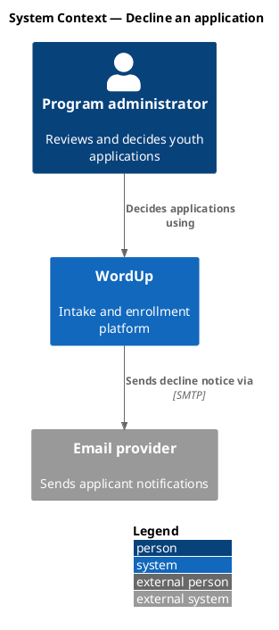
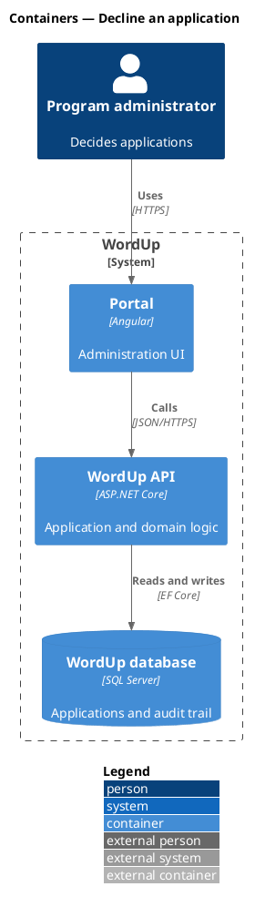
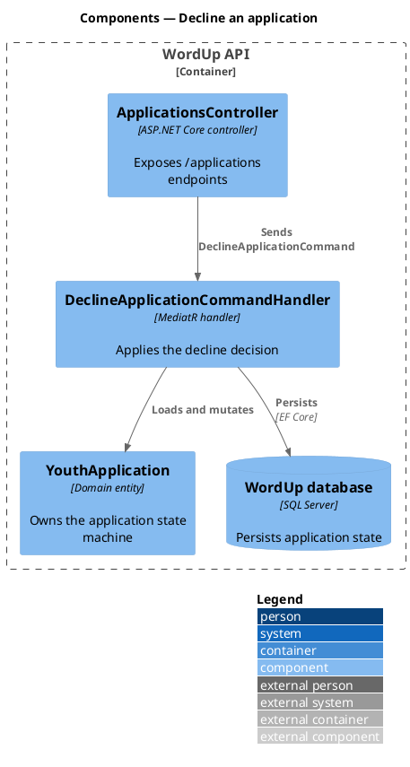
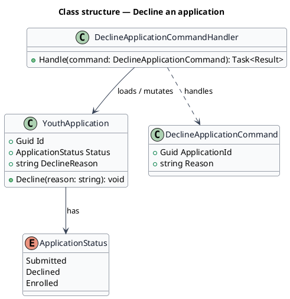
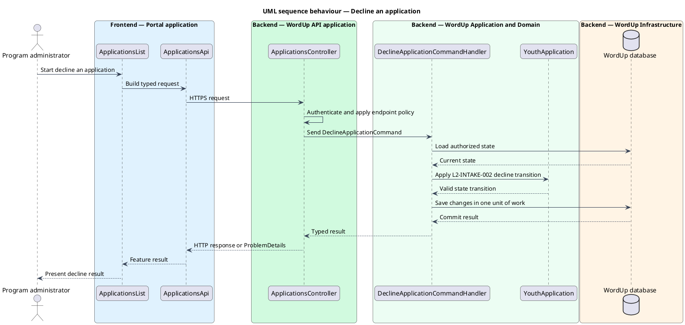

# Diagrams — PlantUML templates and conventions

Every diagram is a PlantUML `.puml` source in the feature's `diagrams/` folder,
rendered to a sibling `.png` by `scripts/render_puml.py`. The README embeds the
`.png` (never the `.puml`) so the picture shows inline on GitHub.

Three diagram kinds appear in every feature design, each answering a different
question:

| Kind | Answers | PlantUML basis |
|------|---------|----------------|
| **C4** | Where does this feature sit — who uses it, what deploys it, what parts make it up? | `!include <C4/...>` |
| **Class** | What is the static structure — the types, their fields/methods, and how they relate? | UML class diagram |
| **Sequence** | What happens at run time — the ordered messages for each behaviour? | UML sequence, with frontend/backend boxes |

Keep diagrams **scoped to the feature slice**. A feature-level C4 component
diagram shows the handful of components this slice touches, not the whole
system. Breadth belongs at the subsystem level; a feature diagram that tries to
show everything becomes unreadable.

---

## C4 diagrams

C4-PlantUML ships inside `plantuml.jar`, so `!include <C4/...>` resolves
**offline** — no internet, no URL includes. Use the bracket-include form the
standard library expects:

- `!include <C4/C4_Context>` — System Context (people + systems)
- `!include <C4/C4_Container>` — Containers (apps, APIs, databases)
- `!include <C4/C4_Component>` — Components (classes/handlers inside a container)

**Build the diagram from the C4 macros the include defines — this is the whole
point of the include.** Once a `.puml` includes a C4 header, every element must
be a C4 macro call: `Person(...)`, `System(...)`, `Container(...)`,
`Component(...)`, `ContainerDb(...)`, the `System_Boundary(...) { }` /
`Container_Boundary(...) { }` blocks, and `Rel(...)` for every relationship. Do
**not** fall back to raw PlantUML shapes (`rectangle`, `component`, `node`,
`[Foo]`, `-->` between bare aliases) inside a C4 diagram — those render as plain
boxes and throw away the C4 styling, legend, and semantics the include exists to
provide. If you find yourself drawing a bare `rectangle`, reach for the matching
C4 macro instead.

Including `<C4/C4_Component>` transitively pulls in the Container and Context
macros too, so a single `!include <C4/C4_Component>` gives you the full macro set
(`Person`, `System`, `Container`, `Component`, boundaries, `Rel`) for all three
diagrams — you do not need three different includes if you prefer one.

Produce, per feature, the C4 levels that carry information for the slice:
a **Context**, a **Container**, and a **Component** diagram. If two levels would
be near-identical for a tiny slice, keep the more detailed one and say so in the
prose rather than padding.

### C4 Context



### C4 Container



### C4 Component



The C4 macro vocabulary to compose from — use these, not raw UML shapes:

| Purpose | Macros |
|---------|--------|
| People | `Person(alias, "label", "desc")`, `Person_Ext(...)` |
| Systems | `System(...)`, `System_Ext(...)`, `SystemDb(...)`, `SystemQueue(...)` |
| Containers | `Container(...)`, `ContainerDb(...)`, `ContainerQueue(...)` |
| Components | `Component(...)`, `ComponentDb(...)`, `ComponentQueue(...)` |
| Grouping | `System_Boundary(alias, "label") { ... }`, `Container_Boundary(...) { ... }`, `Enterprise_Boundary(...) { ... }` |
| Relationships | `Rel(from, to, "label", "tech")`, `Rel_Back(...)`, `BiRel(...)`, directional `Rel_D/U/L/R(...)` |
| Layout | `LAYOUT_WITH_LEGEND()`, `LAYOUT_TOP_DOWN()`, `LAYOUT_LEFT_RIGHT()` |

Every relationship is a `Rel(...)` call, never a bare `a --> b` arrow — the
`Rel` macro is what draws the labelled, styled C4 connector.

---

## Class diagrams

Show both **structure** (fields and methods, with types) and **relationships**.
Prefer the real types from the codebase when the code exists; otherwise model the
types the design introduces. Apply the shared skin header (below) so class and
sequence diagrams look like one set.



Relationship arrows, so the reader can read intent from the line:

| Meaning | Arrow |
|---------|-------|
| Association ("has a") | `-->` |
| Dependency / uses | `..>` |
| Inheritance / implements | `<|--` (`..|>` for interface realization) |
| Composition (owns lifetime) | `*--` |
| Aggregation (references) | `o--` |

Add multiplicities where they matter: `YouthApplication "1" --> "*" ConsentRecord`.

---

## Sequence diagrams

One sequence per behaviour of the slice (the happy path, plus significant
alternates such as a validation failure). Sequence diagrams are where the
**frontend/backend separation and application context** must be visible.

PlantUML `box ... end box` groups participants into a shaded band. Use one box
per architectural home, and label each box with **both** the tier
(*Frontend* / *Backend*) **and** the specific application or layer it belongs to
— that labeling is how "which application" context is shown. Colour the boxes by
tier so the eye can separate frontend from backend at a glance:

| Box | Colour |
|-----|--------|
| `Frontend — <app>` | `#E0F2FE` |
| `Backend — <API app>` | `#D1FADF` |
| `Backend — <Application and Domain>` | `#ECFDF3` |
| `Backend — <Infrastructure>` | `#FFF4E5` |

This template is the gold standard — match its shape, skin, and box structure:



Notes that keep sequences honest:
- Trace to requirements in the message text where a step enforces one, e.g.
  "Apply `L2-INTAKE-002` decline transition." This ties behaviour to the
  Requirements section.
- `->` for a call, `-->` for a return. Keep the return arrows; they show where
  control comes back.
- Model error/alternate flows with `alt` / `else` / `opt` when the slice has
  them, rather than a second near-duplicate diagram.

---

## Rendering

After writing or editing any `.puml`, render the whole tree:

```bash
python <skill>/scripts/render_puml.py docs/detailed-designs
```

The script finds `plantuml.jar` (or `plantuml` on PATH), writes each `.png` next
to its `.puml`, and exits non-zero if any diagram fails — so a red exit means an
image the README links to does not exist yet. Fix the source and re-run until it
is clean.
